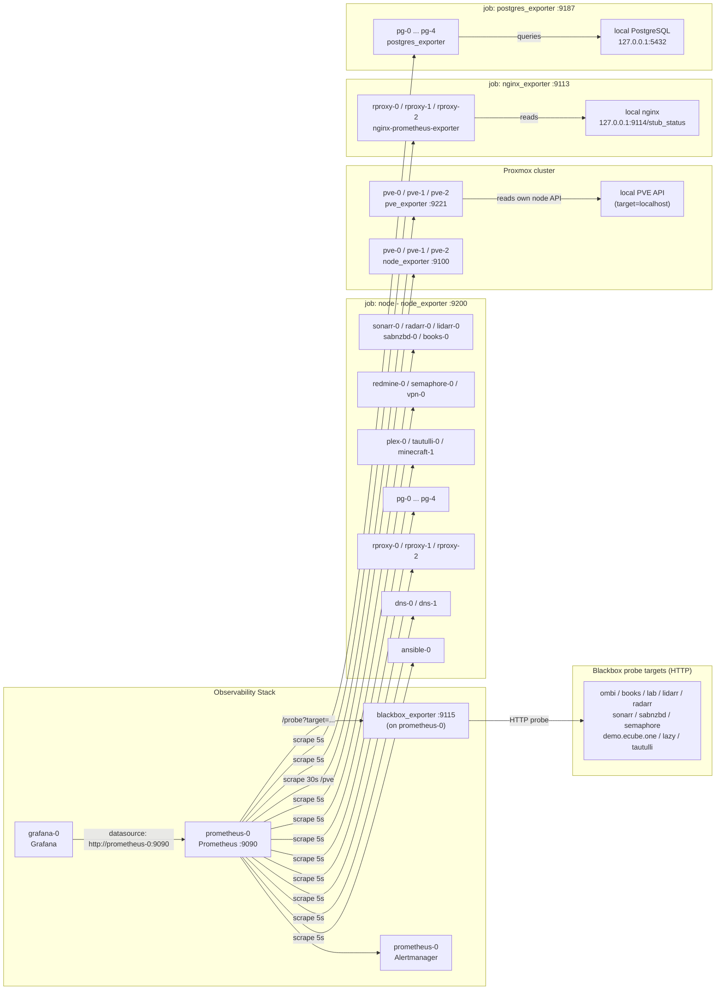

# 🗺️ Reference: Prometheus Exporter Network Map

## 📖 Purpose

This document describes how Prometheus exporters are deployed in this repository: which host each exporter runs on, which host or service it collects data from, which Prometheus server scrapes it, and how Grafana consumes the result.

It is a reference map, not a runbook. For adding new targets, see:

- [`adding-node-exporter-to-an-inventory.md`](adding-node-exporter-to-an-inventory.md)
- [`adding-nginx-exporter-to-an-inventory.md`](adding-nginx-exporter-to-an-inventory.md)
- [`adding-postgres-exporter-to-an-inventory.md`](adding-postgres-exporter-to-an-inventory.md)
- [`adding-blackbox-targets.md`](adding-blackbox-targets.md)

---

## 🧭 Network Map



---

## 🧾 Network Map Summary

Each row is one deployed exporter instance: where it runs, what it reads, and where the metrics go.

| Exporter host                                              | Exporter deployed         | Data source (what it measures)                                                                                       | Scraped by                        | Consumed by | Inventory    |
| ---------------------------------------------------------- | ------------------------- | -------------------------------------------------------------------------------------------------------------------- | --------------------------------- | ----------- | ------------ |
| `ansible-0`                                                | `node_exporter:9200`      | `ansible-0` OS metrics                                                                                               | `prometheus-0:9090`               | `grafana-0` | `ansible`    |
| `dns-0`, `dns-1`                                           | `node_exporter:9200`      | Own OS metrics                                                                                                       | `prometheus-0:9090`               | `grafana-0` | `dns`, `vpn` |
| `minecraft-1`                                              | `node_exporter:9200`      | Own OS metrics                                                                                                       | `prometheus-0:9090`               | `grafana-0` | `minecraft`  |
| `plex-0`                                                   | `node_exporter:9200`      | Own OS metrics                                                                                                       | `prometheus-0:9090`               | `grafana-0` | `plex`       |
| `redmine-0`                                                | `node_exporter:9200`      | Own OS metrics                                                                                                       | `prometheus-0:9090`               | `grafana-0` | `redmine`    |
| `semaphore-0`                                              | `node_exporter:9200`      | Own OS metrics                                                                                                       | `prometheus-0:9090`               | `grafana-0` | `semaphore`  |
| `tautulli-0`                                               | `node_exporter:9200`      | Own OS metrics                                                                                                       | `prometheus-0:9090`               | `grafana-0` | `tautulli`   |
| `vpn-0`                                                    | `node_exporter:9200`      | Own OS metrics                                                                                                       | `prometheus-0:9090`               | `grafana-0` | `vpn`        |
| `sonarr-0`, `radarr-0`, `lidarr-0`, `sabnzbd-0`, `books-0` | `node_exporter:9200`      | Own OS metrics                                                                                                       | `prometheus-0:9090`               | `grafana-0` | `services`   |
| `pg-0` … `pg-4`                                            | `node_exporter:9200`      | Own OS metrics                                                                                                       | `prometheus-0:9090`               | `grafana-0` | `pg`         |
| `pg-0` … `pg-4`                                            | `postgres_exporter:9187`  | Local PostgreSQL `127.0.0.1:5432`                                                                                    | `prometheus-0:9090`               | `grafana-0` | `pg`         |
| `rproxy-0`, `rproxy-1`, `rproxy-2`                         | `node_exporter:9200`      | Own OS metrics                                                                                                       | `prometheus-0:9090`               | `grafana-0` | `rproxy`     |
| `rproxy-0`, `rproxy-1`, `rproxy-2`                         | `nginx_exporter:9113`     | Local nginx `127.0.0.1:9114/stub_status`                                                                             | `prometheus-0:9090`               | `grafana-0` | `rproxy`     |
| `pve-0`, `pve-1`, `pve-2`                                  | `node_exporter:9100`      | Own OS metrics                                                                                                       | `prometheus-0:9090`               | `grafana-0` | `pve`        |
| `pve-0`, `pve-1`, `pve-2`                                  | `pve_exporter:9221`       | That node's own Proxmox API (`target=localhost`)                                                                     | `prometheus-0:9090` (30s, `/pve`) | `grafana-0` | `pve`        |
| `prometheus-0`                                             | `blackbox_exporter:9115`  | Remote HTTP endpoints (ombi, books, lab, lidarr, radarr, sonarr, sabnzbd, semaphore, demo.ecube.one, lazy, tautulli) | `prometheus-0:9090` (`/probe`)    | `grafana-0` | `prometheus` |
| `prometheus-0`                                             | Prometheus itself `:9090` | Own metrics endpoint                                                                                                 | `prometheus-0:9090`               | `grafana-0` | `prometheus` |

---

## 📊 Exporter Summary

| Exporter                    | Inventory group     | Runs on                            | Collects data from                                | Port                             | Scrape job                   |
| --------------------------- | ------------------- | ---------------------------------- | ------------------------------------------------- | -------------------------------- | ---------------------------- |
| `node_exporter`             | `node_exporter`     | Every managed Linux host           | The host it runs on                               | `9200` (`9100` on Proxmox nodes) | `node`                       |
| `nginx-prometheus-exporter` | `nginx_exporter`    | `rproxy-0`, `rproxy-1`, `rproxy-2` | Local nginx `stub_status` on `127.0.0.1:9114`     | `9113`                           | `nginx_exporter`             |
| `postgres_exporter`         | `postgres_exporter` | `pg-0` … `pg-4`                    | Local PostgreSQL at `127.0.0.1:5432`              | `9187`                           | `postgres_exporter`          |
| `prometheus-pve-exporter`   | `pve_exporter`      | `pve-0`, `pve-1`, `pve-2`          | That node's own Proxmox API (`?target=localhost`) | `9221`                           | `pve_exporter` (`/pve`, 30s) |
| `blackbox_exporter`         | `blackbox_exporter` | `prometheus-0`                     | Remote HTTP endpoints listed in inventory         | `9115`                           | `blackbox_http` (`/probe`)   |

Every exporter except Blackbox runs on the host it measures, so all collection is local and Prometheus pulls over the network.

---

## 🔍 Notable Behaviors

### Proxmox exporter is per-node, not per-cluster

`pve_exporter` runs on each Proxmox node but scrapes that node's own local API rather than a single cluster endpoint. The same cluster-wide API token works on all nodes. Prometheus passes `module` and `target` parameters to `/pve` and uses a 30 second interval.

### Blackbox is centralized

`blackbox_exporter` runs on `prometheus-0` itself. Prometheus lists the probe URLs as job targets, then `relabel_configs` rewrite `__address__` back to the local blackbox listener so the probe is executed from `prometheus-0`.

Probe targets are defined in `inventory/prometheus/group_vars/all/main.yml` under `prometheus_setup_blackbox_targets`.

### Scrape targets are merged, not replaced

`roles/prometheus_setup/tasks/exporters.yml` reads the existing `prometheus.yml` from the Prometheus host, seeds a per-job target map keyed by the `instance` label, and then merges targets derived from the current inventory on top.

This means targets registered by a previous run against a different inventory stay in place. Running `playbooks/prometheus/deploy_prometheus_exporters.yml` against a single inventory does not remove hosts from other inventories.

To remove a stale target, edit the rendered configuration on the Prometheus host or remove the host and re-render, since inventory alone cannot delete a previously merged entry.

### Grafana

Grafana is provisioned with a single default Prometheus datasource pointing at the first host in the `prometheus` group:

```yaml
grafana_setup_prometheus_datasource_url: "http://{{ global_ip_addresses[groups['prometheus'][0]] }}:9090"
```

Dashboards in `roles/grafana_setup/files/dashboards/` reference that datasource by the `prometheus` UID and cover node, nginx, PostgreSQL, Proxmox, web service, and reverse proxy health views.

---

## 🧱 Where Things Are Defined

| Concern                    | Location                                             |
| -------------------------- | ---------------------------------------------------- |
| Exporter group membership  | `inventory/<name>/inventory.ini`                     |
| Exporter ports             | `inventory/<name>/group_vars/all/main.yml`           |
| Host IP addresses          | `roles/global/vars/main.yml` (`global_ip_addresses`) |
| Scrape target merge logic  | `roles/prometheus_setup/tasks/exporters.yml`         |
| Rendered Prometheus config | `roles/prometheus_setup/templates/prometheus.yml.j2` |
| Blackbox probe targets     | `inventory/prometheus/group_vars/all/main.yml`       |
| Grafana datasource         | `roles/grafana_setup/defaults/main/main.yml`         |
